# Faster-RCNN-Pytorch-master
# Faster R-CNN代码使用说明书

## 一、我的配置环境

```python
python == 3.10.6
numpy == 1.23.3
opencv == 4.6.0
pillow == 9.2.0
pycocotools == 2.0.6
pytorch == 1.12.1
scipy == 1.9.3
torchvision == 0.13.1
tqdm == 4.64.1
matplotlib == 3.6.2
hdf5 == 1.12.1
```

## 二、参数值文件下载

我们需要的权重包括`voc_weights_resnet.pth`或者`voc_weights_vgg.pth`以及主干的网络权重我已经上传了百度云，可以自行下载。

首先来看第一个权重文件`voc_weights_resnet.pth`，是`resnet`为主干特征提取网络用到的。

第二个权重文件`voc_weights_vgg.pth`，是`vgg`为主干特征提取网络用到的。


顺便训练好的参数我也一并放入了文件夹：

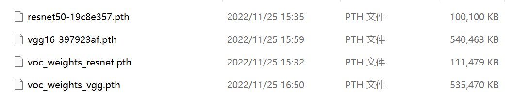

```python
链接：https://pan.baidu.com/s/1IiBMIyw8bF132FQGz79Q6Q 
提取码：dpje
```

## 三、VOC数据集下载

`VOC`数据集下载地址如下，里面已经包括了训练集、测试集、验证集（与测试集一样），无需再次划分：

该数据集为`VOC07+12`的数据集，包括了训练与测试用的数据集。为了训练方便，该数据集中`val.txt`与`test.txt`相同。

```python
链接：https://pan.baidu.com/s/1STBDRK2MpZfJJ-jRzL6iuA 
提取码：vh7m
```

## 四、模型训练步骤

### （1）训练VOC07+12数据集

#### 1.数据集的准备

本文使用`VOC`格式进行训练，训练前需要下载好`VOC07+12`的数据集，解压后放在根目录

根目录就是第一级目录下：

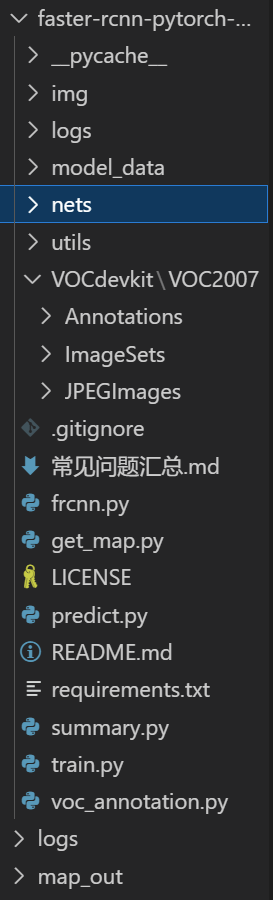

会自动填到`VOCdevkit`文件下面。

#### 2.数据集的处理

修改`voc_annotation.py`里面的`annotation_mode = 2`，运行`voc_annotation.py`生成根目录下的`2007_train.txt`和`2007_val.txt`。

源码对应为：

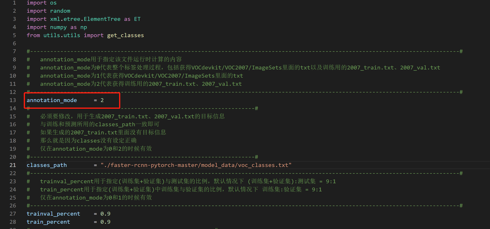

生成的目录为：

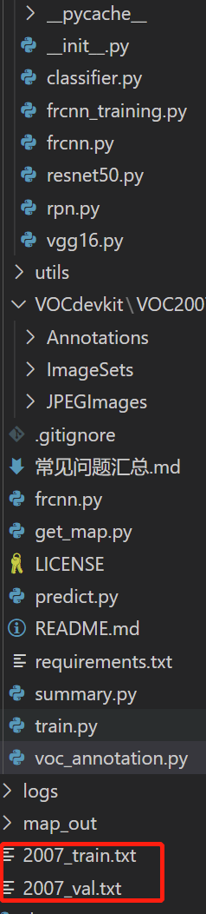

#### 3.开始网络训练

`train.py`的默认参数用于训练`VOC`数据集，直接运行`train.py`即可开始训练。

这个我起初是在自己的笔记本上运行的，显卡为3060，显存为`6G`，但是无法运行，显存不够。

我换到了实验室的电脑，`Ubuntu18.04`，双`2080Ti`，`64G`内存，`i9`处理器，100个batch_size，平均一个花费15分钟左右。

电脑配置不好的同学可以训练不出来，但是没关系，我把训练好的参数也一并上传了，就在第一份百度盘文件中：


#### 4.预测

训练结果预测需要用到两个文件，分别是`frcnn.py`和`predict.py`。

我们首先需要去`frcnn.py`里面修改model_path以及classes_path，这两个参数必须要修改。

model_path指向训练好的权值文件，在logs文件夹里。

classes_path指向检测类别所对应的txt。


完成修改后就可以运行`predict.py`进行检测了。运行后输入图片路径即可检测。

### （2）训练自己的数据集

#### 1.数据集的准备

本文使用`VOC`格式进行训练，训练前需要自己制作好数据集。

训练前将标签文件放在`VOCdevkit`文件夹下的`VOC2007`文件夹下的`Annotation`中。

训练前将图片文件放在`VOCdevkit`文件夹下的`VOC2007`文件夹下的`JPEGImages`中。

#### 2.数据集的处理

在完成数据集的摆放之后，我们需要利用`voc_annotation.py`获得训练用的`2007_train.txt`和`2007_val.txt`。

修改`voc_annotation.py`里面的参数。

第一次训练可以仅修改classes_path，classes_path用于指向检测类别所对应的txt。

训练自己的数据集时，可以自己建立一个`cls_classes.txt`，里面写自己所需要区分的类别。
`./faster-rcnn-pytorch-master/model_data/cls_classes.txt`文件内容为：

例如我们`VOC`数据的类别为：

```python
aeroplane
bicycle
bird
boat
bottle
bus
car
cat
chair
cow
diningtable
dog
horse
motorbike
person
pottedplant
sheep
sofa
train
tvmonitor
```

修改`voc_annotation.py`中的classes_path，使其对应`cls_classes.txt`，并运行`voc_annotation.py`。

#### 3.开始网络训练

**训练的参数较多，均在train.py中，大家可以在下载库后仔细看注释，其中最重要的部分依然是train.py里的classes_path。**

classes_path用于指向检测类别所对应的txt，这个txt和`voc_annotation.py`里面的txt一样！训练自己的数据集必须要修改！

修改完classes_path后就可以运行`train.py`开始训练了，在训练多个epoch后，权值会生成在logs文件夹中。

#### 4.训练结果预测

训练结果预测需要用到两个文件，分别是`frcnn.py`和`predict.py`。在`frcnn.py`里面修改model_path以及classes_path。

model_path指向训练好的权值文件，在logs文件夹里。

classes_path指向检测类别所对应的txt。

完成修改后就可以运行`predict.py`进行检测了。运行后输入图片路径即可检测。

## 五、预测步骤

### （1）使用预训练权重

#### 1.下载完库后解压，在百度网盘下载`frcnn_weights.pth`，放入model_data，运行`predict.py`，输入：

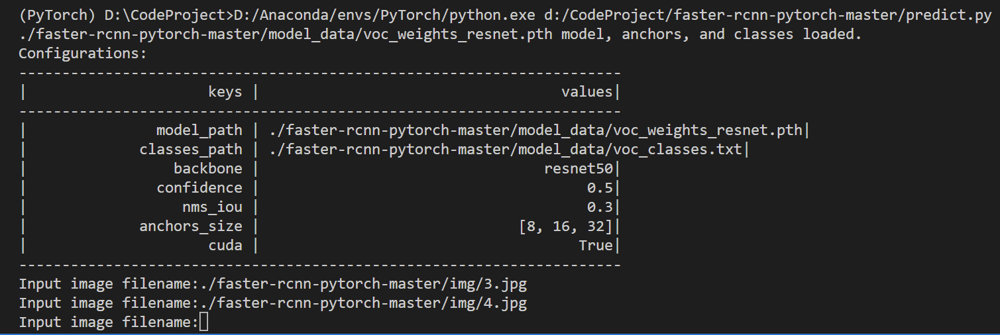

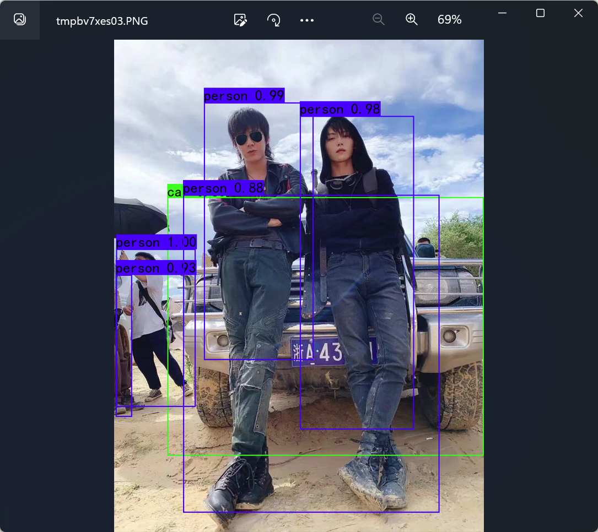

#### 2.在predict.py里面进行设置可以进行fps测试和video视频检测。

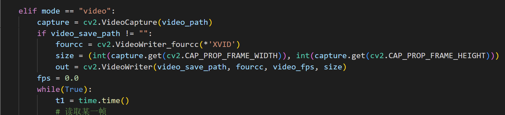


### （2）使用自己训练的权重

#### 1.按照训练步骤训练

#### 2.在`frcnn.py`文件里面，在如下部分修改model_path和classes_path使其对应训练好的文件；model_path对应logs文件夹下面的权值文件，classes_path是model_path对应分的类。

```python
class FRCNN(object):
    _defaults = {
        #--------------------------------------------------------------------------#
        #   使用自己训练好的模型进行预测一定要修改model_path和classes_path！
        #   model_path指向logs文件夹下的权值文件，classes_path指向model_data下的txt
        #
        #   训练好后logs文件夹下存在多个权值文件，选择验证集损失较低的即可。
        #   验证集损失较低不代表mAP较高，仅代表该权值在验证集上泛化性能较好。
        #   如果出现shape不匹配，同时要注意训练时的model_path和classes_path参数的修改
        #--------------------------------------------------------------------------#
        "model_path"    : './faster-rcnn-pytorch-master/model_data/voc_weights_resnet.pth',
        "classes_path"  : './faster-rcnn-pytorch-master/model_data/voc_classes.txt',
        #---------------------------------------------------------------------#
        #   网络的主干特征提取网络，resnet50或者vgg
        #---------------------------------------------------------------------#
        "backbone"      : "resnet50",
        #---------------------------------------------------------------------#
        #   只有得分大于置信度的预测框会被保留下来
        #---------------------------------------------------------------------#
        "confidence"    : 0.5,
        #---------------------------------------------------------------------#
        #   非极大抑制所用到的nms_iou大小
        #---------------------------------------------------------------------#
        "nms_iou"       : 0.3,
        #---------------------------------------------------------------------#
        #   用于指定先验框的大小
        #---------------------------------------------------------------------#
        'anchors_size'  : [8, 16, 32],
        #-------------------------------#
        #   是否使用Cuda
        #   没有GPU可以设置成False
        #-------------------------------#
        "cuda"          : True,
    }
```

### （3）运行predict.py

### （4）在predict.py里面进行设置可以进行fps测试和video视频检测

## 六、评估步骤

## （1）评估VOC07+12的测试集

#### 1.本文使用VOC格式进行评估。

`VOC07+12`已经划分好了测试集，无需利用`voc_annotation.py`生成`ImageSets`文件夹下的txt。

#### 2.在`frcnn.py`里面修改model_path以及classes_path。model_path指向训练好的权值文件，在logs文件夹里。classes_path指向检测类别所对应的txt

#### 3.运行get_map.py即可获得评估结果，评估结果会保存在map_out文件夹中

## （2）评估自己的数据集

#### 1.本文使用`VOC`格式进行评估。

#### 2.如果在训练前已经运行过`voc_annotation.py`文件，代码会自动将数据集划分成训练集、验证集和测试集。如果想要修改测试集的比例，可以修改`voc_annotation.py`文件下的`trainval_percent`。`trainval_percent`用于指定(训练集+验证集)与测试集的比例，默认情况下 (训练集+验证集):测试集 = `9:1`。train_percent用于指定(训练集+验证集)中训练集与验证集的比例，默认情况下 训练集:验证集 = `9:1`。

#### 3.利用`voc_annotation.py`划分测试集后，前往get_map.py文件修改classes_path，classes_path用于指向检测类别所对应的txt，这个txt和训练时的txt一样。评估自己的数据集必须要修改。

#### 4.在`frcnn.py`里面修改model_path以及classes_path。model_path指向训练好的权值文件，在logs文件夹里。classes_path指向检测类别所对应的`txt`。

#### 5.运行`get_map.py`即可获得评估结果，评估结果会保存在map_out文件夹中。

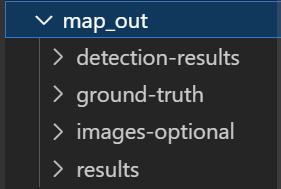

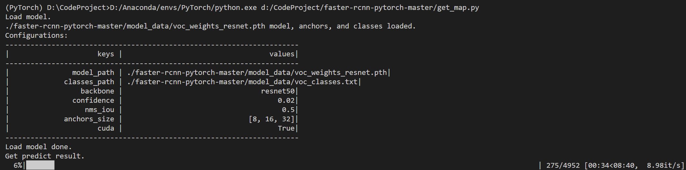

等待一阵子！

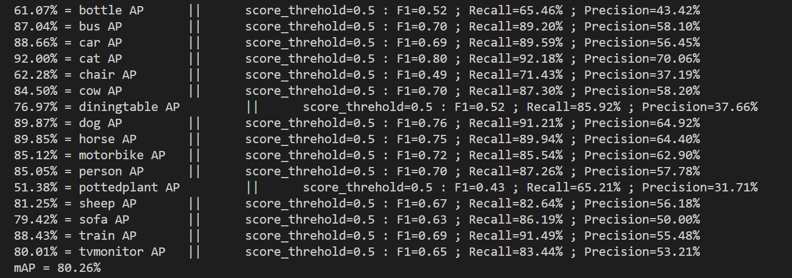

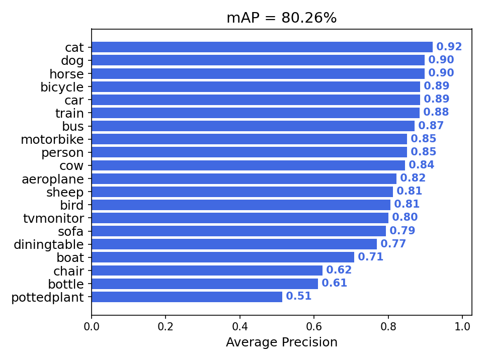

## 七、参考

https://github.com/bubbliiiing/faster-rcnn-pytorch

https://github.com/longcw/faster_rcnn_pytorch

https://github.com/jwyang/faster-rcnn.pytorch
